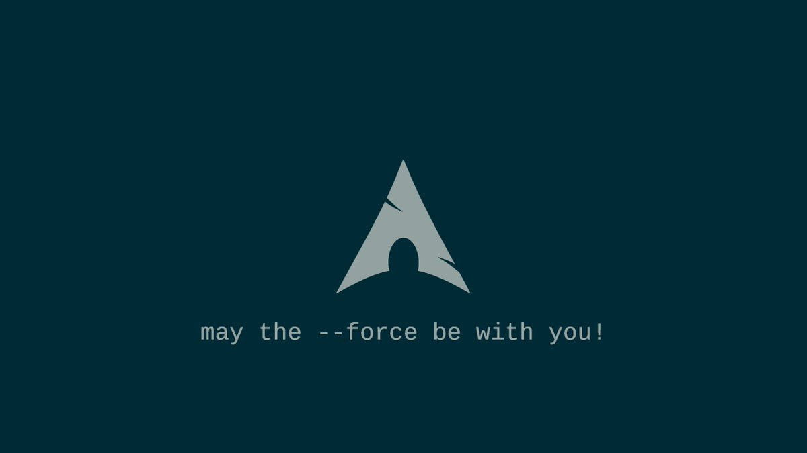

# DevOps cheatsheet collection

## :scroll: Welcome to the Cheat-Sheets and Documentation collection for DevOps Engineers!

### :pushpin: List of Cheat-Sheets and Documentation 

1. DevOps Tools:
   - [DevOps Tools](pdf/DevOps-Tools.pdf)
   - [Cloud Native Landscape](pdf/landscape.pdf)
   

1. [Nginx](pdf/nginx.pdf): Nginx is open-source software for web serving, reverse proxying, caching, load balancing, media streaming, and more.

1. Docker: Docker is a tool designed to make it easier to create, deploy, and run applications using containers.
   - [Docker](pdf/docker.pdf)
   - [Docker by JRebel](pdf/docker_by_jrebel.pdf)   
   - [Docker CheatSheet](pdf/docker-cheatsheet-linux-academy.pdf)
   - [Docker CheatSheet2 ](pdf/Docker-cheatsheet2.pdf)
   - [Docker Containerization CookBook](pdf/Docker-containerization-cookbook.pdf)
   - [Docker Mastery Guide](pdf/Docker-Mastery-Guide.pdf)
   - [Docker Tutorial](pdf/DockerTutorial.pdf)

1. Ansible is the simplest way to automate apps and IT infrastructure.
	- [Ansible](pdf/ansible.pdf)
	- [Ansible for DevOps](pdf/ansible-for-devops.pdf)
	- [Ansible Best Practices](pdf/ansible-best-practices.pdf)	

1. Python: Python is an interpreted, high-level, general-purpose programming language.
   - [All in one Python cheatsheet](pdf/All-in-One-Python-Cheat-Sheet.pdf)
   - [Python 3 - The Basics](pdf/cheatsheet-python-grok.pdf)
   - [Python for Beginners](pdf/python_beginners.pdf)
   - [140 + Python begginer programs](pdf/140+Basic-Python-Programs.pdf)
   - [Python 100 programs](pdf/Learn-Python-With-Amazing-Experience.pdf)
   - [Python for loops](pdf/Python-For-Loop.pdf)
   - [Python while loops](pdf/Python-While-Loop.pdf)
   - [240 Python practice exercises](pdf/240-Python-Practice-Exeecises.pdf)

1. Git: Git is the open-source distributed version control system that facilitates GitHub activities on your laptop or desktop.
   - [Git by Atlassian](pdf/atlassian-git-cheatsheet.pdf)
   - [Git by GitHub](pdf/git_by_github.pdf)
   - [Git by Git-Tower](pdf/git_by_git-tower.pdf)
   - [Git/GitHub - Pull Request](pdf/github.pdf)
   - [Git A - Z](pdf/Git&GitHub.pdf)
   - [Git & GitHub Cheat Sheet](pdf/Git&GitHubCheatSheet.pdf)

1. [PowerShell](pdf/Powershell.pdf): PowerShell is a task automation and configuration management framework from Microsoft.

1. [Jenkins](pdf/Jenkins-Cheat-Sheet-converted.pdf): Jenkins is an open-source automation server that enables developers to reliably build, test, and deploy their software.

1. Continuous Integration and Continuous Delivery (CI/CD): CI/CD frameworks have made the practice of software development increasingly complex—and overwhelming.
   - [CI/CD Framework](pdf/cicd-framework_by_densify.pdf)

1. Kubernetes: Kubernetes is an open-source system for automating deployment, scaling, and management of containerized applications.
   - [Kubernetes K8s Cheat-Sheet](pdf/Kubernetes-Cheat-Sheet.pdf)
   - [Kubernetes cheat-sheet 16pg](pdf/Kubernetes-cheatsheet-16pg.pdf)
   - [Kubectl](pdf/kubectl.pdf): Kubectl is a command-line interface for running commands against Kubernetes clusters.
   - [Kubectl CheatSheet](pdf/Kubectl-CheatSheet.pdf): another cheat sheet.
   - [Kubernetes practical guide](pdf/Practical-guide-to-kubernetes.pdf): Kubernetes practical guide.
   - [Kubernetes from scratch](pdf/Kubernetes-from-scratch.pdf): Kubernetes from scratch.
   - [Kubernetes for beginners](pdf/Kubernetes-Documentation-For-Beginners.pdf): Kubernetes documentation for beginners.

1. Linux:
   - Bash: Bash is a Unix shell and command language written by Brian Fox for the GNU Project as a free software replacement for the Bourne shell.
     - [Linux Commands 1](pdf/linux-bash.pdf)
     - [Linux Commands 2](pdf/linux-bash-terminal.pdf)
     - [Linux Commands 3](pdf/linux_commands.pdf)
     - [Linux common issues & sollutions](pdf/Linux-Common-Issue-&-Solution.pdf)
     - [Linux 101 Hacks](pdf/Linux-101-hacks.pdf): Practical examples to build a strong foundation in Linux
     - [Linux Network Tools](pdf/linux-networking-tool): A compilation of various Linux networking tools.
   - [Network-tools](pdf/linux-networing-tools.pdf): Network-tools cheat-sheet includes ping, curl, wget, ssh, and more.
   - [Cron](pdf/cron.pdf): Cron is a time-based job scheduler in Unix-like computer operating systems.
   - [Rsync](pdf/rsync.pdf): Rsync is a fast and versatile file copying tool used for local and remote file transfers.
   - [cURL](pdf/curl.pdf)
   - [SSH](pdf/ssh.pdf)
   - [NC (Netcat)](pdf/netcat.pdf)
   - [Nmap](pdf/nmap.pdf): Nmap is a powerful network scanning tool.
     - [Nmap Cheat Sheet](pdf/Nmap-Cheat-Sheet.pdf) by Comparitech.
   - [OpenSSL](pdf/openssl.pdf)
   - [Ethtool](pdf/ethtool.pdf)
   - [ngrep](pdf/ngrep.pdf)
   - [grep](pdf/grep.pdf)   
   - [find](pdf/find.pdf)   
   - [tar](pdf/tar.pdf)
   - [ps](pdf/ps.pdf)
   - [top](pdf/top.pdf)
   - [Wireshark](pdf/wireshark.pdf): Wireshark is a free and open-source packet analyzer.

1. [Puppet](pdf/puppet): Puppet lets you automate the enforcement, security, and delivery of your hybrid or cloud-native infrastructure.

1. Cloud Developer:
   - [50 Linux Command for Cloud Engineers](pdf/50-Linux-Command-for-Cloud-Engineers.pdf) 

1. [Google Cloud Developer](pdf/GoogleCloudDeveloper.pdf): This cheat-sheet covers building scalable and highly available applications using Google-recommended practices and tools that leverage fully managed services.

1. [AZURE Cloud](pdf/Azure-Handbook.pdf): Azure Handbook for beginners

1. Amazon Web Services (AWS): AWS provides on-demand cloud computing platforms and APIs on a metered pay-as-you-go basis.
   - [AWS: The Basics](pdf/AWS-Basic-Cheat-Sheet.pdf)
   - [AWS Services](pdf/aws-services.pdf)
   - [AWS Cost Information](pdf/aws-cost.pdf)
   - [Explanation Of Aws Services ](pdf/Explanation-Of-Aws-Services.pdf)
   - [AWS Cloud Product ](pdf/AWS-Cloud-Product.pdf)

1. Infrastructure as Code (IaC): IaC is the process of managing and provisioning computer data centers through machine-readable definition files.
   - [Terraform](pdf/terraform-cheatsheet.pdf): Terraform is an open-source infrastructure-as-code software tool for managing cloud services.

1. System Design: System Design is defined as a process of creating an architecture for different components, interfaces, and modules of the system and providing corresponding data helpful in implementing such elements in systems.
   - [System Design Blueprint](pdf/System_Design_Blueprint.pdf): Terraform is an open-source infrastructure-as-code software tool for managing cloud services.

1. HTML - CSS: For Web Development
   - [HTML cheatsheet](pdf/Complete-HTML-CheatSheet.pdf)
   - [CSS cheatsheet for beginners](pdf/css-cheatsheet-for-beginners.pdf)
   - [HTML in 60 seconds](pdf/HTML-in-60-seconds.pdf)

1. Free learning tutorials
   - [Free IT Videos ](pdf/Free_IT_Videos.pdf)
